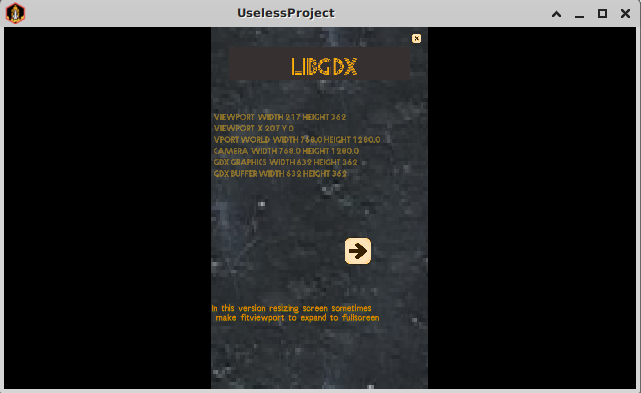
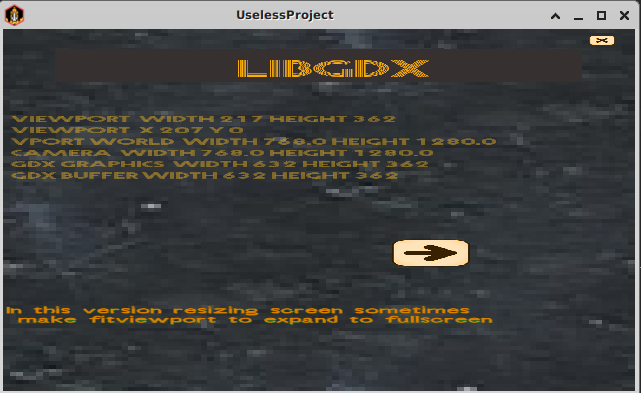
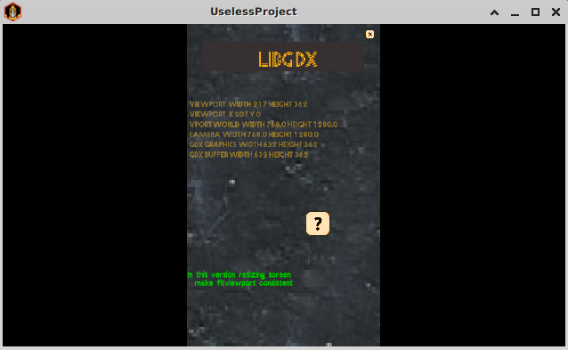

**Useless Project**

*How to*

Obtain the zip file  or clone from github to test this libgdx application.

*Reproduce the magic*

in project directory :

``gradle build ;
gradle lwjgl3:run ``

Then modify window size quite quickly 
until it decides to stretch the window to full screen

*images*

When FitViewport works :

When FitViewport fail  :

It always should use the defined Viewport

